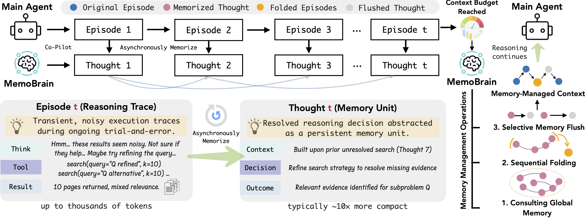

# MemoBrain: Executive Memory as an Agentic Brain for Reasoning

<div align="center">

**Unleash Coherent Reasoning—MemoBrain Empowers LLMs with Executive Memory**

[]()
[](https://huggingface.co/TommyChien)
[](LICENSE)
[](https://www.python.org/downloads/)

[📄 Paper]() | [🤗 MemoBrain-4B](https://huggingface.co/TommyChien/MemoBrain-4B) | [🤗 MemoBrain-8B](https://huggingface.co/TommyChien/MemoBrain-8B) | [🤗 MemoBrain-14B](https://huggingface.co/TommyChien/MemoBrain-14B) 

</div>

---

## 📋 Abstract

Complex reasoning in tool-augmented agent frameworks is inherently **long-horizon**, causing reasoning traces and transient tool artifacts to accumulate and strain the bounded working context of large language models. Without explicit memory mechanisms, such accumulation disrupts logical continuity and undermines task alignment. This positions memory not as an auxiliary efficiency concern, but as a **core component** for sustaining coherent, goal-directed reasoning over long horizons.

We propose **MemoBrain**, an executive memory model for tool-augmented agents that constructs a dependency-aware memory over reasoning steps, capturing salient intermediate states and their logical relations. Operating as a co-pilot alongside the reasoning agent, MemoBrain organizes reasoning progress without blocking execution and actively manages the working context. Specifically, it:

- **Prunes** invalid steps
- **Folds** completed sub-trajectories
- **Preserves** a compact, high-salience reasoning backbone under a fixed context budget

Together, these mechanisms enable explicit cognitive control over reasoning trajectories rather than passive context accumulation.

---

## 🎯 Overview

MemoBrain introduces an **executive memory system** that acts as a cognitive co-pilot for reasoning agents. Unlike traditional approaches that passively accumulate context, MemoBrain actively manages the reasoning trajectory by:

1. **Memory Construction**: Building a dependency-aware graph of reasoning steps
2. **Flush**: Removing invalid or redundant reasoning nodes  
3. **Fold**: Compressing completed sub-trajectories into compact summaries
4. **Context Management**: Maintaining a fixed-size, high-salience reasoning backbone

<div align="center">

<p><i>Figure 1: MemoBrain architecture and workflow</i></p>
</div>

---

## 🚀 Quick Start

> **⚠️ Note:** This project is under ongoing intensive development. Stay tuned for more features and improvements!

### Installation

```bash
git clone https://github.com/qhjqhj00/MemoBrain.git
cd MemoBrain
pip install -e .
```


### Basic Usage

#### Model Selection

MemoBrain can work with **any LLM** as the foundation model via OpenAI-compatible API. However, we recommend using:

1. **Strong commercial models** (e.g., DeepSeek V3.2, GPT-5) for best performance
2. **Our fine-tuned MemoBrain models** trained specifically for memory operations:
   - 🤗 [MemoBrain-4B](https://huggingface.co/TommyChien/MemoBrain-4B) (Qwen3-4B-Instruct-2507-based)
   - 🤗 [MemoBrain-8B](https://huggingface.co/TommyChien/MemoBrain-8B) (Qwen3-8B-based)
   - 🤗 [MemoBrain-14B](https://huggingface.co/TommyChien/MemoBrain-14B) (Qwen3-14B-based)

#### Deploy MemoBrain Models with vLLM

```bash
# Install vLLM
# Deploy MemoBrain-8B
vllm serve TommyChien/MemoBrain-8B --port 8000

```

#### Python Usage

```python
import asyncio
from memobrain import MemoBrain

async def main():
    # Step 1: Initialize MemoBrain
    # Option A: Use our fine-tuned model (recommended)
    memory = MemoBrain(
        api_key="EMPTY",  # vLLM doesn't require API key
        base_url="http://localhost:8000/v1",
        model_name="TommyChien/MemoBrain-8B"
    )
    
    # Option B: Use commercial models
    # memory = MemoBrain(
    #     api_key="your-api-key",
    #     base_url="https://openrouter.ai/api/v1",
    #     model_name="openai/gpt-5"
    # )
    
    # Step 2: Initialize memory with your task
    memory.init_memory("Solve a complex research problem")
    
    # Step 3: Memorize conversation interactions
    await memory.memorize([
        {"role": "user", "content": "What is the capital of France?"},
        {"role": "assistant", "content": "The capital of France is Paris."}
    ])
    
    await memory.memorize([
        {"role": "user", "content": "What is its population?"},
        {"role": "assistant", "content": "Paris has approximately 2.2 million inhabitants."}
    ])
    
    # Step 4: Optimize memory (flush invalid steps & fold completed sub-trajectories)
    optimized_messages = await memory.recall()
    print(f"Memory optimized: {len(optimized_messages)} messages")

asyncio.run(main())
```

**💡 Recommended Memorize Unit:**

The recommended unit for `memorize()` is an **episode** — a complete reasoning cycle that typically includes:
- **Thinking**: The agent's reasoning process
- **Tool Call**: Action taken by the agent (e.g., search, browse, code execution)
- **Tool Response**: The result/feedback from the tool

For example, in a tool-augmented agent workflow:
```python
# One episode: thinking → tool call → tool response
await memory.memorize([
    {"role": "assistant", "content": "I need to search for information about Paris..."},
    {"role": "user", "content": "Search results: Paris is the capital of France..."}
])

# Another episode: thinking → tool call → tool response  
await memory.memorize([
    {"role": "assistant", "content": "Let me visit the Wikipedia page for more details..."},
    {"role": "user", "content": "Page content: Paris has a population of 2.2 million..."}
])
```

This episodic granularity helps MemoBrain better understand the logical structure and dependencies in your reasoning trajectory.

### Core API

| Method | Description |
|--------|-------------|
| `MemoBrain(api_key, base_url, model_name)` | Create a MemoBrain instance |
| `init_memory(task: str)` | Initialize the memory graph with a task description |
| `memorize(messages: List[Dict])` | Record new conversation turns (async) |
| `recall()` | Optimize memory via flush & fold operations (async) |

**Message Format:**
```python
[
    {"role": "user", "content": "Your question"},
    {"role": "assistant", "content": "Assistant's response"}
]
```

---

## 💡 Examples

### Example 1: Simple Usage

See [`examples/example_usage.py`](examples/example_usage.py) for a basic example of loading and visualizing memory:

```python
import json
from memobrain import MemoBrain

# Load test data
data = [json.loads(line) for line in open("examples/test_tree.jsonl")]

# Initialize MemoBrain
memobrain = MemoBrain(
    api_key="your-api-key",
    base_url="https://api.deepseek.com",
    model_name="deepseek-chat",
)

# Load memory from dictionary
memobrain.load_dict_memory(data[0]["memory"])

# Visualize memory graph
print(memobrain.graph.pretty_print())
```

### Example 2: Multi-Round Conversation

```python
import asyncio
from memobrain import MemoBrain

async def research_task():
    # Initialize MemoBrain
    memory = MemoBrain(
        api_key="your-api-key",
        base_url="https://api.openai.com/v1",
        model_name="gpt-4"
    )
    memory.init_memory("Research AI development history")
    
    # Multiple conversation rounds
    conversations = [
        [
            {"role": "user", "content": "When did AI begin?"},
            {"role": "assistant", "content": "AI research started in the 1950s..."}
        ],
        [
            {"role": "user", "content": "What is the Turing test?"},
            {"role": "assistant", "content": "The Turing test is a test of a machine's ability..."}
        ],
        [
            {"role": "user", "content": "When did deep learning emerge?"},
            {"role": "assistant", "content": "Deep learning gained prominence in the 2010s..."}
        ]
    ]
    
    for conv in conversations:
        await memory.memorize(conv)
        print(f"Memorized {len(conv)} messages")
    
    # Optimize after accumulating conversations
    optimized = await memory.recall()
    print(f"Optimized to {len(optimized)} messages")
    
    return optimized

asyncio.run(research_task())
```

### Example 3: Periodic Memory Optimization

```python
import asyncio
from memobrain import MemoBrain

async def managed_memory_loop(conversations):
    memory = MemoBrain(
        api_key="your-api-key",
        base_url="https://api.openai.com/v1",
        model_name="gpt-4"
    )
    memory.init_memory("Long-running research task")
    
    message_count = 0
    for conv in conversations:
        await memory.memorize(conv)
        message_count += len(conv)
        
        # Optimize every 20 messages
        if message_count >= 20:
            optimized = await memory.recall()
            print(f"Optimized: {message_count} → {len(optimized)} messages")
            message_count = 0

# asyncio.run(managed_memory_loop(your_conversations))
```

---

## 🗺️ Roadmap

- [x] **Release Paper** - Executive Memory as an Agentic Brain for Reasoning
- [x] **Release Model** - MemoBrain-8B model on Hugging Face
- [x] **Release Code** - Open-source MemoBrain implementation
- [ ] **Deep Research Example** - Comprehensive example using MemoBrain for complex research tasks
- [ ] **Additional Features** - Enhanced memory operations, visualization tools, and integration examples

---

## 📊 Experimental Results

We evaluate MemoBrain on challenging long-horizon reasoning benchmarks. Results show consistent improvements across different base agents when integrated with MemoBrain-8B.

### Main Results

**Best scores in bold**, second-best <u>underlined</u>. Results marked with † are cited from original papers.

<table align="center">
<thead>
  <tr>
    <th rowspan="2"><b>Method</b></th>
    <th colspan="4"><b>General AI Assistant (GAIA)</b></th>
    <th colspan="4"><b>WebWalkerQA</b></th>
  </tr>
  <tr>
    <th><b>L1</b></th>
    <th><b>L2</b></th>
    <th><b>L3</b></th>
    <th><b>Avg.</b></th>
    <th><b>Easy</b></th>
    <th><b>Med.</b></th>
    <th><b>Hard</b></th>
    <th><b>Avg.</b></th>
  </tr>
</thead>
<tbody>
  <tr>
    <td colspan="9" style="background-color: #f0f0f0;"><b>Direct Reasoning (w/o Retrieval)</b></td>
  </tr>
  <tr>
    <td>QwQ-32B</td>
    <td>25.6</td><td>9.6</td><td>16.7</td><td>16.5</td>
    <td>7.5</td><td>2.1</td><td>3.8</td><td>4.0</td>
  </tr>
  <tr>
    <td>GPT-4o</td>
    <td>23.1</td><td>15.4</td><td>8.3</td><td>17.5</td>
    <td>6.7</td><td>6.0</td><td>4.2</td><td>5.5</td>
  </tr>
  <tr>
    <td>DeepSeek-R1-671B</td>
    <td>43.6</td><td>26.9</td><td>8.3</td><td>31.1</td>
    <td>5.0</td><td>11.8</td><td>11.3</td><td>10.0</td>
  </tr>
  <tr>
    <td colspan="9" style="background-color: #f0f0f0;"><b>Retrieval-Augmented Generation</b></td>
  </tr>
  <tr>
    <td>Vanilla RAG (QwQ-32B)</td>
    <td>33.3</td><td>36.5</td><td>8.3</td><td>32.0</td>
    <td>36.9</td><td>26.1</td><td>33.5</td><td>31.2</td>
  </tr>
  <tr>
    <td>Query Planning (QwQ-32B)</td>
    <td>48.7</td><td>25.0</td><td>8.3</td><td>32.0</td>
    <td>28.8</td><td>35.7</td><td>30.8</td><td>32.5</td>
  </tr>
  <tr>
    <td>Iterative RAG (QwQ-32B)</td>
    <td>51.3</td><td>28.8</td><td>8.3</td><td>35.0</td>
    <td>29.4</td><td>32.9</td><td>31.3</td><td>31.5</td>
  </tr>
  <tr>
    <td colspan="9" style="background-color: #f0f0f0;"><b>Tool-Integrated Reasoning</b></td>
  </tr>
  <tr>
    <td>ReAct (QwQ-32B)</td>
    <td>48.7</td><td>34.6</td><td>16.7</td><td>37.8</td>
    <td>35.6</td><td>29.1</td><td>13.2</td><td>24.1</td>
  </tr>
  <tr>
    <td>ReAct (GPT-4o)</td>
    <td>51.2</td><td>34.6</td><td>8.3</td><td>34.6</td>
    <td>34.6</td><td>42.0</td><td>23.9</td><td>33.8</td>
  </tr>
  <tr>
    <td>ReAct (Qwen3-30B-A3B)</td>
    <td>48.7</td><td>26.9</td><td>8.3</td><td>33.0</td>
    <td>26.3</td><td>27.5</td><td>21.7</td><td>25.2</td>
  </tr>
  <tr>
    <td>WebThinker-32B†</td>
    <td>56.4</td><td>50.0</td><td>16.7</td><td>48.5</td>
    <td>58.8</td><td>44.6</td><td>40.4</td><td>46.5</td>
  </tr>
  <tr>
    <td>WebDancer (QwQ-32B)†</td>
    <td>56.4</td><td>48.1</td><td>25.0</td><td>46.6</td>
    <td>49.4</td><td>55.0</td><td>29.6</td><td>43.2</td>
  </tr>
  <tr>
    <td>ReSum-GRPO†</td>
    <td>--</td><td>--</td><td>--</td><td>48.5</td>
    <td>--</td><td>--</td><td>--</td><td>--</td>
  </tr>
  <tr>
    <td>DeepAgent-RL†</td>
    <td>66.7</td><td>59.6</td><td>25.0</td><td>58.3</td>
    <td>--</td><td>--</td><td>--</td><td>--</td>
  </tr>
  <tr>
    <td>AgentFold-30B-A3B†</td>
    <td>--</td><td>--</td><td>--</td><td>67.0</td>
    <td>--</td><td>--</td><td>--</td><td>--</td>
  </tr>
  <tr>
    <td>GLM-4.6</td>
    <td>76.9</td><td>59.6</td><td>33.3</td><td>63.1</td>
    <td>64.4</td><td>62.9</td><td>48.8</td><td>58.2</td>
  </tr>
  <tr>
    <td>DeepResearch-30B-A3B</td>
    <td><u>79.5</u></td><td>67.3</td><td>41.7</td><td>68.9</td>
    <td><u>72.5</u></td><td><u>71.8</u></td><td><u>61.3</u></td><td><u>68.2</u></td>
  </tr>
  <tr style="background-color: #e8e8e8;">
    <td colspan="9"><b>MemoBrain-8B</b></td>
  </tr>
  <tr>
    <td>&nbsp;&nbsp;&nbsp;w/ GLM-4.6</td>
    <td><u>79.5</u></td><td><u>71.2</u></td><td><u>50.0</u></td><td><u>71.8</u></td>
    <td>68.8</td><td>69.6</td><td><u>61.3</u></td><td>66.5</td>
  </tr>
  <tr>
    <td>&nbsp;&nbsp;&nbsp;w/ DeepResearch-30B-A3B</td>
    <td><b>82.1</b></td><td><b>69.2</b></td><td><b>58.3</b></td><td><b>74.5</b></td>
    <td><b>73.1</b></td><td><b>72.1</b></td><td><b>64.2</b></td><td><b>69.6</b></td>
  </tr>
</tbody>
</table>

**Key Findings:**
- MemoBrain-8B achieves **state-of-the-art** performance when integrated with strong base agents
- Consistent improvements across **all difficulty levels** (L1, L2, L3) on GAIA
- Significant gains on **hard tasks** (L3: +16.6 points, WebWalker Hard: +2.9 points)
- Demonstrates the effectiveness of explicit memory management for long-horizon reasoning

---

## 📖 Citation

If you find MemoBrain useful for your research, please cite our paper:

```bibtex
@article{memobrain2026,
  title={MemoBrain: Executive Memory as an Agentic Brain for Reasoning},
  author={},
  journal={arXiv preprint arXiv:XXXX.XXXXX},
  year={2026}
}
```

---

## 🌟 Star History

If you find this project helpful, please consider giving it a ⭐! Your support helps us continue improving MemoBrain.

[](https://star-history.com/#YOUR_USERNAME/MemoBrain&Date)

---

## 🤝 Contributing

We welcome contributions! Please feel free to:

- 🐛 Report bugs and issues
- 💡 Suggest new features
- 📝 Improve documentation
- 🔧 Submit pull requests

---

## 📄 License

This project is licensed under the MIT License - see the [LICENSE](LICENSE) file for details.


---

<div align="center">


[⬆ Back to Top](#memobrain)

</div>
